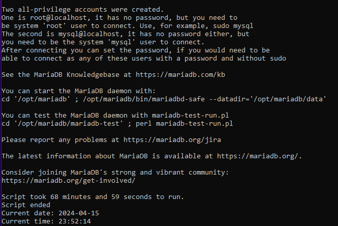
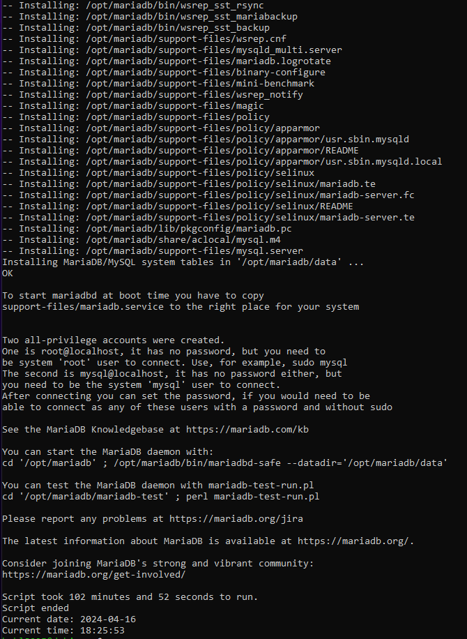
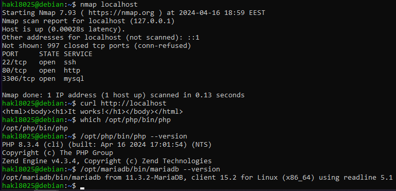

_Documentation_

Minimal grade version requirement (only apache, php, mariadb compiled from source)
Hardware Specifications:
RAM: 8 GB
HARD DISK SIZE: 70 GB
CPU: 1.6
VCPU: 2
Script running time:
68 minutes 59 seconds / 01:08:59

Maximum grade version requirement version (apr, expat, apr-util, apache, php, mariadb compiled from source)
Hardware Specifications:
RAM: 10 GB
HARD DISK SIZE: 100 GB
CPU: 2
VCPU: 2
Script running time:
102 minutes 52 seconds / 01:42:52

Checked everything:

